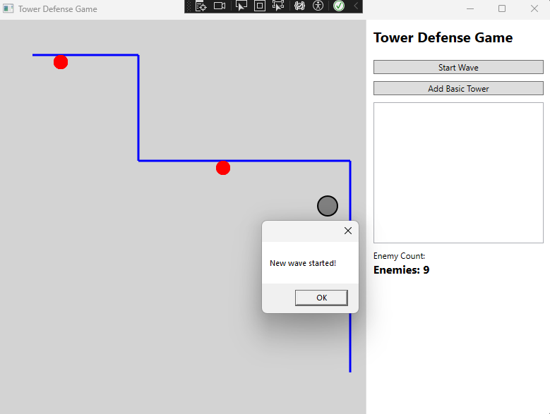
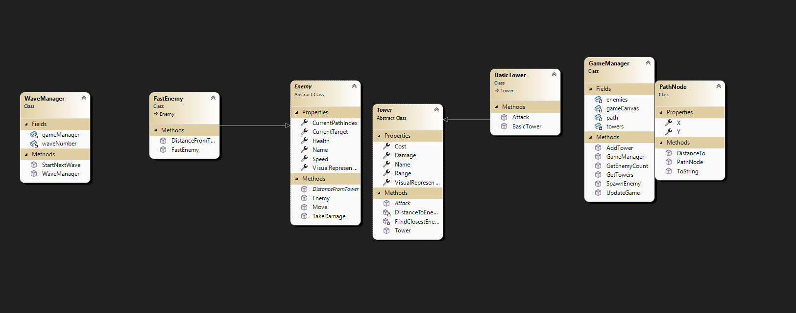

<body>
    

        <h1>🎮 Axel Carmona's Portfolio </h1>
        <h2>My Projects</h2>
        

            <h3> Tower Defense | Project 3 (WPF, C#)</h3>
            
            
A game where you spawn towers to defend a pathway that enemies will be marching through while trying to reach the end of the path. A WPF Application

            
        

        

            <h3> Axel's Wordle (WPF, C#)</h3>
            

            
Just a classic game of Wordle as you try to guess the word.

            

        

        

            <h3> Coffee (C#, .NET)</h3>
            

            
An application that calculates the temperature of coffee and iced tea constantly 

            

        

           

            <h3> Card Game Selector (C#, .NET)</h3>
            

            
A game with three games to choose from: Apple or Oranges, Highest Match, and Higher or Lower.

            

        

           

            <h3> Event Handler (Stocks) (C#, .NET)</h3>
            

            
An application that calculates the Stock Exchange, allowing the player to see how the Stock Exchange is constantly being changed 

            

        

        <footer>
            © 2025 Axel Carmona | Programming Portfolio
        </footer>
    

</body>

